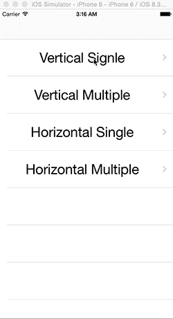

# SACollectionViewVerticalScalingFlowLayout

[](http://cocoadocs.org/docsets/SACollectionViewVerticalScalingFlowLayout)
[](http://cocoadocs.org/docsets/SACollectionViewVerticalScalingFlowLayout)
[](http://cocoadocs.org/docsets/SACollectionViewVerticalScalingFlowLayout)
[](https://bitdeli.com/free "Bitdeli Badge")

## About

SACollectionViewVerticalScalingFlowLayout applies scaling up or down effect to appearing or disappearing cells. In addition, animation of UIDynamics applies each cell.

 

## Features

- [x] Vertical Scaling
- [x] Rewrite in Swift 
- [x] Support Horizonal Scaling

## Installation

#### CocoaPods

SACollectionViewVerticalScalingFlowLayout is available through [CocoaPods](http://cocoapods.org). If you have cocoapods 0.36.0 or greater, you can install
it, simply add the following line to your Podfile:

    pod "SACollectionViewVerticalScalingFlowLayout"

#### Manually

Add the [SACollectionViewVerticalScalingFlowLayout](./SACollectionViewVerticalScalingFlowLayout) directory to your project. 


## Usage

To run the example project, clone the repo, and run `pod install` from the Example directory first.

#### From Storyboard or Xib

Go to 'Attributes Inspector' of Storyboard or Xib, and set Layout tab 'Custom'. And set class tab 'SACollectionViewVerticalScalingFlowLayout'.


#### From Code

Write this code at viewDidLoad method and so on.

```swift

collectionView.registerClass(SACollectionViewVerticalScalingCell.self, forCellWithReuseIdentifier:kCellIdentifier)
let layout = SACollectionViewVerticalScalingFlowLayout()
layout.scaleMode = .Hard
layout.alphaMode = .Easy
layout.scrollDirection = .Vertical
collectionView.collectionViewLayout = layout
    
```

if you want to use Horizontal mode.

```swift

layout.scrollDirection = .Horizontal

```

## Customization

You can customize scaling and alpha of apearing or disapering cells.

#### For Scale

You can change alpha to set ScaleModeType for scaleMode property of SACollectionViewVerticalScalingFlowLayout.(default: .Easy)

```swift

var scaleMode: SACollectionViewVerticalScalingFlowLayoutScaleMode

enum SACollectionViewVerticalScalingFlowLayoutScaleMode {
    case None, Easy, Hard
}


```

#### For Alpha

You can change alpha to set AlphaModeType for alphaMode property of SACollectionViewVerticalScalingFlowLayout. (default: .Easy)

``` swift
	
var alphaMode: SACollectionViewVerticalScalingFlowLayoutScaleMode
	
enum SACollectionViewVerticalScalingFlowLayoutAlphaMode {
    case None, Easy, Hard
}

```

#### For Cell

You use containerView instead of contentView like this code, then you can add what kind of view you want to add.

``` swift

let cell = collectionView.dequeueReusableCellWithReuseIdentifier(kCellIdentifier, forIndexPath: indexPath)
let imageView = UIImageView(frame: cell.bounds)
imageView.image = UIImage(named: "cat")
cell.containerView?.addSubview(imageView)

```

## Requirements
- Xcode 6.3 or greater
- iOS7.0(manually only) or greater
- ARC

## Author

Taiki Suzuki, s1180183@gmail.com

## License

SACollectionViewVerticalScalingFlowLayout is available under the MIT license. See the LICENSE file for more info.

